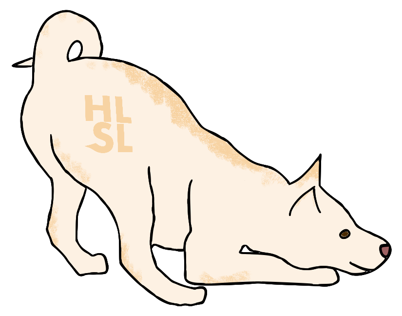

# HLSL Specifications

This repository contains documentation for HLSL feature proposals and specifications. Please see the documentation for
the HLSL Feature [Proposal Process](docs/Process.md) for more information on proposals.

A listing of the active proposals is available [here](proposals/).

This repository also contains specifications for the HLSL language. The draft
HLSL specification is available in
[HTML](https://microsoft.github.io/hlsl-specs/specs/hlsl.html) and
[PDF](https://microsoft.github.io/hlsl-specs/specs/hlsl.pdf).

## Contributing

This project welcomes contributions and suggestions.  Most contributions require you to agree to a
Contributor License Agreement (CLA) declaring that you have the right to, and actually do, grant us
the rights to use your contribution. For details, visit https://cla.opensource.microsoft.com.

When you submit a pull request, a CLA bot will automatically determine whether you need to provide
a CLA and decorate the PR appropriately (e.g., status check, comment). Simply follow the instructions
provided by the bot. You will only need to do this once across all repos using our CLA.

This project has adopted the [Microsoft Open Source Code of Conduct](https://opensource.microsoft.com/codeofconduct/).
For more information see the [Code of Conduct FAQ](https://opensource.microsoft.com/codeofconduct/faq/) or
contact [opencode@microsoft.com](mailto:opencode@microsoft.com) with any additional questions or comments.

## Public Design Meeting

The HLSL team organizes a meeting every two weeks which is open to the public to discuss work in progress in this repository.
That includes proposals for new HLSL features as well as the ongoing work to write a language specification.

For more information on this meeting and the terms and conditions for
participation, see the [Design Meeting](docs/DesignMeeting.md) documentation.

## Trademarks

This project may contain trademarks or logos for projects, products, or services. Authorized use of Microsoft 
trademarks or logos is subject to and must follow 
[Microsoft's Trademark & Brand Guidelines](https://www.microsoft.com/en-us/legal/intellectualproperty/trademarks/usage/general).
Use of Microsoft trademarks or logos in modified versions of this project must not cause confusion or imply Microsoft sponsorship.
Any use of third-party trademarks or logos are subject to those third-party's policies.
