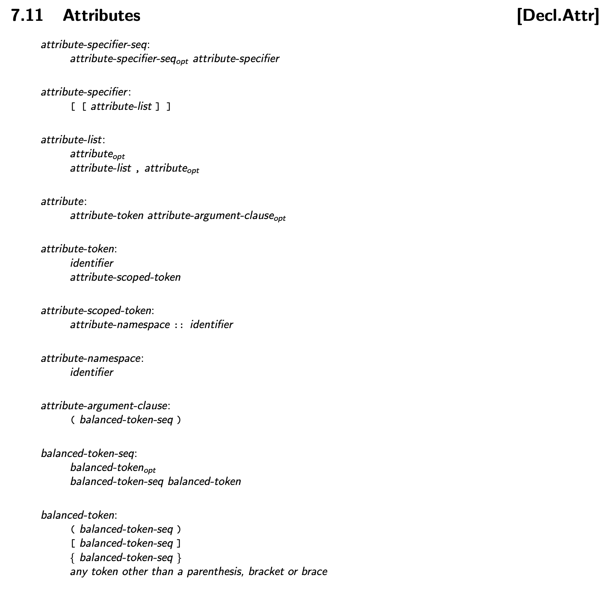
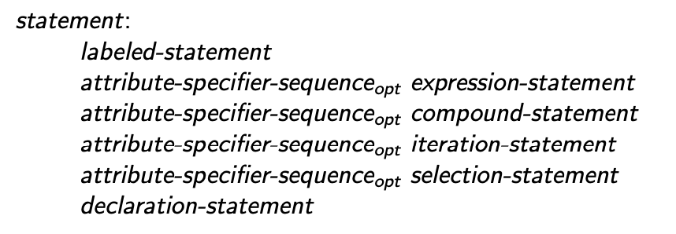
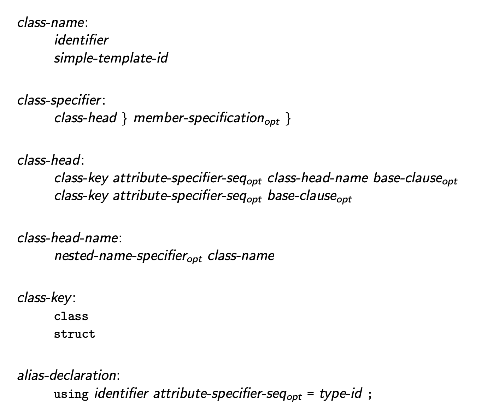

* Planned Version: 202y

## Introduction

The C++ 11 ISO standard introduced a standard syntax for attribute annotations
which is grammatically unambiguous when annotating a wide variety of language
elements. This syntax has become common, recognized and well known, and is an
ideal addition to HLSL.

## Motivation

HLSL has two syntaxes for specifying source annotations. One, the
Microsoft-style C Attribute syntax, which uses single brackets `[]` to enclose
an attribute and it's arguments:

```c++
[WaveOpsIncludeHelperLanes]
[shader("compute")]
[numthreads(1,1,1)]
```

The second, the HLSL annotation syntax, which annotates variable, field and
parameter declarations using a `:` to separate the name from the specifier:

```c++
SamplerState samp1 : register(s5);
Texture2D<float4> text1 : register(t3);

float4 main(float2 a : A) : SV_Target {
  ...
}
```

The existing syntaxes in HLSL have limitations. With the introduction of
bitfields in HLSL 2021, HLSL semantic syntax on members of a struct or class is
syntactically ambiguous with bitfields. Take the following code example:

```c++
  struct {
    uint i : SV_RenderTargetArrayIndex;
  }
```

In this case the syntax is ambiguous with a bitfield declaration, on
encountering the `:` token the parser must look ahead to see if the next
token is a semantic identifier or an integer constant.

This case is further ambiguous with user-specified semantics where the following
code is ambiguous and currently _not_ interpreted as a bitfield declaration:

```c++
  static int Foo = 1;
  struct {
    uint i : Foo;
  }
```

If we wish to add source annotations to more grammatical elements in the future
we will encounter more ambiguities because the `:` character has other meanings
in C and modern C++ as well. to name a few examples: the ternary operator
(`condition ? a : b`), range-based for syntax (`for (variable : collection)`),
and switch label marking (`case 1:`).

We will also encounter ambiguities with the `[]` syntax. We may encounter issues
with array indexing which valid in contexts where we may wish to annotate
sources in the future. In the future this ambiguity could grow if we incorporate
more C++ features, like lambdas.

## Proposed solution

Adopting C++ attributes enables an unambiguous annotation syntax for all the
cases where HLSL annotations are supported. Using C++11 attributes the example
above can be written as:

```c++
  struct {
    uint i [[hlsl::system_value(RenderTargetArrayIndex)]];
  }
```

Which has no syntactic ambiguity. As in the example above, C++ attributes can
also be namespaced, which allows for a clearer delineation of the attribute's
applicability. C++ defines that namespaced attributes not supported by the
compiler can be ignored. This enables more robust code sharing in codebases that
contain both C++ and HLSL.

Additionally, introducing C++ 11 attributes enables placing attributes on more
grammatical constructs in the language. C++ 11 attributes can be applied to
statements, declarations and expressions.

Below are a few more examples of C++ attributes that we could support:

```c++
  struct [[hlsl::layout_attribute]] { // applies to the struct type
    int x;
    int y;
  };

  Texture2D<float4> Tex [[hlsl::register(1, 0)]]; // applies to `Tex`;

  uint i [[hlsl::system_value(RenderTargetArrayIndex)]]; // applies to `i`.
  [[hlsl::system_value(RenderTargetArrayIndex)]] uint j; // applies to `j`.
  uint &[[hlsl::AddressSpace(1)]] Ref = ...;  // applies to the type `uint &`.

  [[hlsl::system_value(Target)]] // applies to the function `fn`.
  float3 fn( ) {
    [[hlsl::fast]] // applies to the compound expression `{...}`.
    {
      ...
    }
    float f = [[hlsl::strict]](1.0 * 2.0); // applies to the parenthesis expression `(...)`.

    [[hlsl::unroll]] // applies to the for-loop expression.
    for (int x = 0; x < 10; ++x) {
      ...
    }
  }
```

## Detailed design

The simplest explanation of this feature is supporting C++11 attribute syntax on
all shared grammar elements between HLSL and C++. This spec attempts to detail
some of the grammar and parsing implications and will specify the process by
which existing attributes will convert to C++ attributes.

### Attribute Parsing

This proposal introduces grammar formulations for parsing attributes matching
some formulations from C++ `dcl.attr.grammar`. Specifically:

```latex
\begin{grammar}
  \define{attribute-specifier-seq}\br
  \opt{attribute-specifier-seq} \textit{attribute-specifier}\br

  \define{attribute-specifier}\br
  \terminal{[ [} \textit{attribute-list} \terminal{] ]}\br

  \define{attribute-list}\br
  \opt{attribute}\br
  \textit{attribute-list} \terminal{,} \opt{attribute}\br

  \define{attribute}\br
  \textit{attribute-token} \opt{attribute-argument-clause}\br

  \define{attribute-token}\br
  \textit{identifier}\br
  \textit{attribute-scoped-token}\br

  \define{attribute-scoped-token}\br
  \textit{attribute-namespace} \terminal{::} \textit{identifier}\br

  \define{attribute-namespace}\br
  \textit{identifier}\br

  \define{attribute-argument-clause}\br
  \terminal{(} \textit{balanced-token-seq} \terminal{)}\br

  \define{balanced-token-seq}\br
  \opt{balanced-token}\br
  \textit{balanced-token-seq} \textit{balanced-token}\br

  \define{balanced-token}\br
  \terminal{(} \textit{balanced-token-seq} \terminal{)}\br
  \terminal{[} \textit{balanced-token-seq} \terminal{]}\br
  \terminal{\{} \textit{balanced-token-seq} \terminal{\}}\br
  any token other than a parenthesis, bracket or brace\br
\end{grammar}
```


In contrast to existing HLSL annotations and Microsoft-style attributes, these
formulations use case-sensitive identifier tokens


#### Statements

> Note: This is already reflected in the language specification.

```latex
\begin{grammar}
    \define{statement}\br
    labeled-statement\br
    \opt{attribute-specifier-sequence} expression-statement\br
    \opt{attribute-specifier-sequence} compound-statement\br
    \opt{attribute-specifier-sequence} iteration-statement\br
    \opt{attribute-specifier-sequence} selection-statement\br
    declaration-statement
\end{grammar}
```


#### Declarations

The `attribute-specifier-seq` element supports annotating type declarations. The
following grammar formulations are valid:

```latex
\begin{grammar}
  \define{class-name}\br
  \textit{identifier}\br
  \textit{simple-template-id}\br

  \define{class-specifier}\br
  \textit{class-head} \terminal{\{} \opt{member-specification} \terminal{\}}\br


  \define{class-head}\br
  \textit{class-key} \opt{attribute-specifier-seq} \textit{class-head-name} \opt{base-clause}\br
  \textit{class-key} \opt{attribute-specifier-seq} \opt{base-clause}\br

  \define{class-head-name}\br
  \opt{nested-name-specifier} \textit{class-name}\br

  \define{class-key}\br
  \terminal{class}\br
  \terminal{struct}\br

  \define{alias-declaration}\br
  \terminal{using} \textit{identifier} \opt{attribute-specifier-seq} \terminal{=} \textit{type-id} \terminal{;}\br
\end{grammar}
```


### Attribute Specification Language

Attributes annotate source constructs with information. An attribute is said to
be _applied to_ the entity or statement identified by the source construct.

Some attributes may be required by an implementation for correct code
generation, others may be optionally ignored. An implementation must issue a
diagnostic on all ignored attributes unless otherwise specified by the
definition of the attribute behavior.

> Note: an example here would be optimization hint attributes which an
> implementation is allowed to ignore without diagnosing.

Each attribute may specify specific behavior for parsing attribute arguments.
Any attribute that does not specify specific parsing behavior shall be parsed
with the general behavior described here.

> Note: The clause above enables attributes like the clang availability
> attribute which supports named parameters (e.g.
> `[[clang::availability(shadermodel, introduced=6.3)]]`), HLSL has a use for
> similar functionality.

An empty attribute specifier has no effect. The order in which attributes
applied to the same source construct are written shall not be significant. When
parsing attributes any token that satisfies the requirements of an identifier
shall be treated as an identifier even if it has alternate meaning outside the
attribute (e.g. keywords). Name lookup is not performed on identifiers within
attribute-tokens. The attribute-token refers to the attribute being parsed,
which determines requirements for parsing the optional
attribute-argument-clause.

If an attribute is applied to an entity or statement for which the attribute is
not allowed to be applied, the program is ill-formed.

For attribute-tokens not specified in this specification the behavior is
implementation-defined.

Two consecutive square bracket tokens shall only appear when introducing an
attribute-specifier. Any other occurrence of two consecutive square brackets is
ill-formed.

### Removal of HLSL Annotation Syntax

With the introduction of C++ attribute syntax the HLSL annotation syntax will be
removed from the language. In Clang, C++ attribute syntax can be supported in
both HLSL 202x and 202y language modes with deprecation warnings, fix-it and
rewriting tool support in Clang. This will allow easier migration of code from
HLSL 202x to 202y. This feature will not be supported in DXC.

The following new attributes are introduced to replace HLSL annotations.

#### hlsl::user_value(string[, int=0])

The new `hlsl::user_value` attribute replaces user-defined semantics. The first
argument to the attribute is a string which can contain any valid C-string. The
second optional value is an index.

#### hlsl::system_value(enum[, int=0])

The new `hlsl::system_value` attribute replaces system value semantics. The
first argument is an enumeration which specifies which system value is being
bound, and the second optional value is an index.

#### hlsl::packoffset(int[, int=0])

The new `hlsl::packoffset` attribute replaces the `packoffset` HLSL annotation.
The attribute takes one required and one optional integer arguments. The second
integer must be greater than or equal to 0 and less than or equal to 3.

The first value specifies the starting row for packing data, and the second
value specifies the starting column. Existing `packoffset` arguments written
`c<row>.<column_letter>` map to the new attribute as `hlsl::packoffset(<row>,
<column_index>)`, where `<column_index>` maps as in the table below.

| column_letter | column_index |
| ------------- | ------------ |
| x             | 0            |
| y             | 1            |
| z             | 2            |
| w             | 3            |

#### hlsl::binding(int[, int=0])

The new `hlsl::binding` attribute replaces the `binding` HLSL annotation. The
attribute takes one required and one optional integer arguments. The first
integer argument specifies the binding index. the second integer specifies
the binding scope of the binding index. The interpretation of this attribute is
defined by the target runtime's binding model.

In DirectX, the first value maps as the register value, and the second the
register space. DirectX scopes bindings by resource class, allowing the same
register and space assignments to be specified for resources of different types
(e.g. a UAV and SRV may have the same register and space values without
aliasing).

In Vulkan, the first value maps as the binding index, and the second maps as the
descriptor set index.

#### hlsl::payload_access(<enum>, ...)

The new `hlsl::payload_access` attribute replaces the `read` and `write` HLSL
annotations for raytracing payload access qualifiers. The attribute takes an
enum value specifying `read` or `write` to denote the type of access and a
variable argument list of enumeration values specifying the stage that the
access qualifier applies to. Consider the following currently valid HLSL:

```hlsl
struct [raypayload] Payload {
  float f : read(caller, anyhit) : write(caller, anyhit);
};
```

Under HLSL 202y this code will be rewritten as:

```hlsl
using namespace hlsl;
struct [[raypayload]] Payload {
  float f [[payload_access(read, caller, anyhit), payload_access(write, caller, anyhit)]];
};
```
