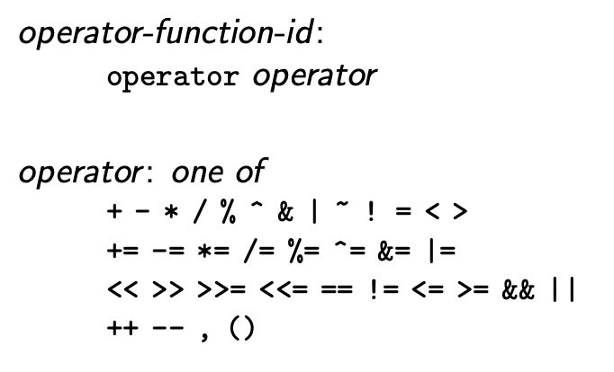

# Non-member Operator Overloading

## Instructions

* Proposal: [0008](0008-non-member-operator-overloading.md)
* Author(s): [Chris Bieneman](https://github.com/llvm-beanz)
* Sponsor: [Chris Bieneman](https://github.com/llvm-beanz)
* Status: **Under Consideration**
* Planned Version: 202y
* Related Proposal(s): [0006 Reference Types](0006-reference types.md)

## Introduction

HLSL 2021 introduced operator overloading for member operators of user defined
data types. Only supporting member operators has some drawbacks, specifically
defining binary operators where the LHS is a built-in type is impossible,
additionally scoping operators to namespaces is also impossible.

## Motivation

Beyond common use cases where global operators are nice to have, users adopting
HLSL 2021 have provided feedback that global operator overloading would be a
significant benefit.

HLSL 2021's introduction of short circuiting boolean operators users have been
forced to translate their code that operates on HLSL vector types to use the
new `select`, `and` and `or` intrinsics. We believe the new intrinsics are the
right step for the language in removing ambiguity and clearly expressing code
meaning. Global operator overloading provides an opportunity for the language to
remain clear and unambiguous, while allowing users to define custom operators
that allow them to not migrate legacy code.

## Proposed solution

This change requires fully adopting C++ rules for operator overload resolution
and supporting defining global and namespace scoped operator overloads. The
limitations currently in place on operator overloading (disallowing overloading
operators that idiomatically return references) will remain in effect on
non-member operators as well unless the restrictions are lifted as proposed in
[0006 Reference Types](0006-reference types.md).

Because this solution should not break existing code, it could also be enabled
under HLSL 2021 as an extension. Using the feature in HLSL 2021 mode as an
extension will produce warnings so that users can be aware of portability issues
that may arise between compiler versions.

## Detailed Design

### **Overloaded Operators** Spec Language

```latex
\begin{grammar}
  \define{operator-function-id}\br
    \terminal{operator} operator\br

  \define{operator} one of\br
    \terminal{+} \terminal{-} \terminal{*} \terminal{/} \terminal{\%}
    \terminal{\^{}} \terminal{\&} \terminal{|} \terminal{\~{}} \terminal{!}
    \terminal{=} \terminal{<} \terminal{>}\br
    \terminal{+=} \terminal{-=} \terminal{*=} \terminal{/=} \terminal{\%=}
    \terminal{\^{}=} \terminal{\&=} \terminal{|=}\br
    \terminal{<<} \terminal{>>} \terminal{>>=} \terminal{<<=}
    \terminal{==} \terminal{!=} \terminal{<=} \terminal{>=} \terminal{\&\&}
    \terminal{||}\br
    \terminal{++} \terminal{--} \terminal{,} \terminal{()}
    \terminal{\[\]}\br
\end{grammar}
```


An _operator function_ is a function declared with an _operator-function-id_ as
its name. An _operator function template_ is a function template
operator-function-id as its name.

Both the binary and unary forms of `+`, `-`, `*` and `&` can be overloaded.
Except in the case of the unary `++` operator (see below), binary and unary operators are
differentiated by the sum of implicit and explicit parameters; two for a
binary operator and one for a unary operator.

An operator function can be called explicitly by using the _operator-function_id
as the name of the function.

An operator function shall either be a non-static member function or a
non-member function. If an operator is a non-member function it must have at
least one parameter of class or enumeration type.

No argument to an operator function shall have a default value. Operators cannot
have more or fewer parameters than the number required for the corresponding
operator.

#### Increment and Decrement Operators

A user-defined function `operator++` or `operator--` implements the prefix and
postfix operators. If the function has only one implicit or explicit parameter
it defines a prefix operator for the type of the single parameter. Otherwise the
function will have two parameters where the implicit object or first parameter
are of class type, and the second parameter is of `int` type, and it will
implement the postfix operator for the type of the first parameter.

When a user-defined post-fix operator is called the value of the `int` parameter
will be `0`.

### Overload Resolution Language

The HLSL draft specification already defines overload resolution to occur in all
the relevant places required for non-member overload resolution (see:
[[Overload.Res]](https://microsoft.github.io/hlsl-specs/specs/hlsl.html#Overload.Res)).

## Alternatives considered

Non-member operator overloading is a feature that is generally useful, an no
alternatives have been considered to the feature itself. Reflecting on the
problems caused by HLSL 2021 removing boolean operators from vector types other
options were considered.

One considered option was to roll back the HLSL 2021 removal of vector
operators. Operator short circuiting was introduced in HLSL 2021 to reduce
behavioral differences between HLSL and C/C++. With operator short circuiting
vector operator aren't intuitive because they can't short circuit.

Having scalar operators short circuit and vector operators not was also
considered. The argument against that approach is that having two code
representations that look the same but behave differently is unintuitive. This
gets more unintuitive when you consider that with the introduction of templates
the same literal line of code could be used for both vector and scalar
conditionals with different behavior.

For these reasons, this proposal posits that HLSL 2021's decision is the correct
approach for the language. This proposal gives users the ability to introduce
source compatibility if they choose, but at their own maintenance expense. It
also adopts behavior that is consistent with C++ for evaluation of logical
operators.

## Acknowledgments

This proposal is the result of conversations with users and teammates. Thank you
everyone who contributed feedback on HLSL 2021.
