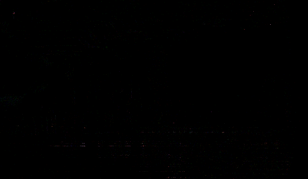

<!--  -->

 
* Planned Version: HLSL 202x
* PRs: [#175](https://github.com/microsoft/hlsl-specs/pull/175)
* Issues: [#73](https://github.com/microsoft/hlsl-specs/issues/73),
  [microsoft/DirectXShaderCompiler#6147](https://github.com/microsoft/DirectXShaderCompiler/issues/6147),
  [microsoft/DirectXShaderCompiler#3973](https://github.com/microsoft/DirectXShaderCompiler/issues/3973),
  [microsoft/DirectXShaderCompiler#4683](https://github.com/microsoft/DirectXShaderCompiler/issues/4683),
  [microsoft/DirectXShaderCompiler#5493](https://github.com/microsoft/DirectXShaderCompiler/issues/5493),
  [microsoft/DirectXShaderCompiler#6410](https://github.com/microsoft/DirectXShaderCompiler/issues/6410),
  [shader-slang/slang#1185](https://github.com/shader-slang/slang/issues/1185)

## Introduction

In C-based languages literals are tokens which the compiler interprets in the
most basic translation to preserve the exact meaning expressed in the source to
the final program.

HLSL's handling of literals is complex, undocumented, and inconsistent.

## Motivation

The implementation of literal types in DXC today is the source of significant
bugs and user confusion. The issues linked in the header are a non-exhaustive
sampling of issues (resolved and unresolved) which have stemmed from DXC's
implementation of literal types.

Since the current behavior is complex and undocumented, matching the existing
behavior in Clang without copying the implementation is impossible. This
proposal defines a common solution that is simple and implementable in DXC and
Clang to allow users to adapt to the new behavior before switching to Clang.

## Proposed solution

The [official HLSL
documentation](https://learn.microsoft.com/en-us/windows/win32/direct3dhlsl/dx-graphics-hlsl-appendix-grammar#floating-point-numbers)
defines floating literal values to be 32-bit. This is consistent with the
[OpenGL Shader Language
Specification](https://registry.khronos.org/OpenGL/specs/gl/GLSLangSpec.4.60.pdf),
which states:

> When the suffix "lf" or "LF" is present, the literal has type double.
> Otherwise, the literal has type float.

This proposal adopts this behavior for floating literals.

Similarly this proposal adopts C rules for non-suffixed integer literals. The
type of a base-10 non-suffixed integer literal is the first integer type from
the list [`int32_t`, `int64_t`] which can represent the specified literal value.
The type of an octal, hexadecimal or binary non-suffixed integer literal is the
first type from the list [`int32_t`, `uint32_t`, `int64_t`, `uint64_t`] that can
represent the specified literal value.

### Benefits of this solution

The most clear and obvious benefits of this solution are its simplicity. The
implementation of this behavior is just a few lines of code. The full
specification is simple and concise.

This solution also works with modern C++ features that have come into HLSL like
templates, and other features like `auto` which we would like to add. It
addresses issues like the bugs with the [ternary
operator](microsoft/DirectXShaderCompiler#6147), where a comprehensive solution
within the rules of C/C++ is nigh impossible.

This solution also allows for a radical simplification of our handling in IR
layers because we can restrict the compiler to only generating valid operation
overloads.

> Note: today DXC supports generating some invalid overloads so as to allow
> literal values to constant evaluate at double precision. If the invalid
> operations aren't fully optimized away, this can result in generating invalid
> DXIL.

### Problems with this solution

This is a significant change in behavior which will cause issues for existing
shaders. We have observed rendering defects caused by the difference in
classifying types for integer literals (more details below). We have also
speculated that issues could arise for two further reasons: (1) variations in
precision of compile-time constant evaluation, and (2) the change in conversion
rank for un-suffixed literals (`literal float` was the lowest rank `float` ranks
above smaller types).

In the observed case and the two hypothetical cases, this behavior difference
will cause bugs that will be challenging to diagnose in the midst of a larger
compiler transition (i.e. adopting Clang).

For that reason, this feature proposal targets HLSL 202x, with support for the
new literal behavior in DXC.

### Experimentation

In writing this proposal a key thesis was proposed that the impact of this
change on developers would be minimal because DXC's behavior for DXIL is
undocumented, complex, and different from other shader compilers (including
DXC's SPIR-V generator). The last point is important and relevant because a
large percentage of shader code is compiled with multiple different shader
compilers which implement different language semantics. Because of this, it is
believed that many existing shaders are engineered to be resilient to subtle
behavioral differences like the ones this change would cause.

#### Methodology

A modified version of DXC implementing the new behavior enabled under all
language modes is available
[here](https://github.com/llvm-beanz/DirectXShaderCompiler/tree/cbieneman/conforming-literals).
This modified version of DXC was used as the compiler for testing to identify
the impact of this change on existing shaders used in production software.

Tests were performed by both Microsoft and Google using private test suites. In
Google's testing, *all tests passed all tests with no issues*.

#### Microsoft Test Suite

The test cases are PIX captures running on Xbox Series X. Most of the captures
are rendered frames of in-development or shipped games, or sample content
produced from external developers working on games or engine technology. The
remaining captures are test programs developed internally at Microsoft.

For the test runs the image difference tolerance was zero, meaning that any
frame which had even a single bit difference in output was marked as a failure.

#### Summary of Results

Of 271 capture test cases, 10 shaders failed to compile with the new compiler
and 19 capture tests produced a binary different frame rendering. The
binary-different results can be further broken down by severity:

* Extremely minor - 8 test cases
* Minor - 3 test cases
* Subtle visible differences - 2 test cases
* Catastrophic visible differences - 6 test cases

##### Compile Failures

All 10 shaders that failed to compile hit a variation of the issue reported as
[DXC/#6315](https://github.com/microsoft/DirectXShaderCompiler/issues/6315). The
failing shaders call `asfloat16` with a floating literal value, but `asfloat16`
does not have a full set of overloads.

##### Extremely Minor

Extremely minor failures produced image differences so minor that they are not
even visible with assistive image difference tools. They appear in binary
differences as pixel values being only a few bits off (in most cases 1-2 bits
per pixel).

##### Minor

Minor failures produced image differences that appeared visible with assistive
image difference tools, but not visibly distinct in final rendered images. These
appeared as pixels that deviate from the reference value by more than a few
bits. Examples of the image diff view are:




##### Subtle Visible Differences

A small number of tests had significant differences in clusters of pixels large
enough to produce minor visual artifacts. These differences are significant
enough and represent inaccuracies in rendered output that we would expect a
software developer to be concerned by and wish to address even though the
overall image still rendered mostly correctly.

##### Catastrophic Visible Differences

We have 6 test cases, all from the same software title which had severe
obviously incorrect rendering which would make the title unplayable. One
important note about this title is that it is an Xbox & Windows exclusive title.
Since the title is platform exclusive its shaders may not need to be resilient
to different language semantics implemented by different shader compilers.

#### Rendering Defect Root Cause

Continued investigation of the rendering defects tracked in
[#184](https://github.com/microsoft/hlsl-specs/issues/184) revealed that the
problems in both the catastrophic and subtle cases are not caused by loss of
floating point precision. Instead they are the result of a subtle behavioral
difference for literal integers. In HLSL `literal int` is always a signed
integer, whereas in C a non-base 10 literal integer may be unsigned if the most
significant bit is 1.

This difference in rules results in a subtle behavioral difference for bit
shifts. Given the following code:

```c++
export float Fn(int inInt, inFloat) {
  int Val = (inInt & 0xffff0000) >> 16);
  return Val* inFloat
}
```

In DXC, the `literal int` is always signed, so the bit shift is an arithmetic
shift (most significant bit is filled with the sign bit). In the C rules that
this proposal adopts, a non-base 10 integer literal is `unsigned` if the msb is
1, so the bit shift is a logical shift (most significant bit is filled with 0).

The behaviors in FXC are not documented. Observationally hexadecimal literals
are `uint` and octal literals are not supported. Treating hexadecimal literals
as unsigned produces the same behavior when shifting a literal as C, however
FXC's behavior for decimal literals is subtly different from C.

The following differences have been identified between FXC's literal behavior
and C:

* Non-base 10 literals that would fit in 32 bits without the high-bit set result
  in uint in HLSL int in C.
* No promotion to uint occurs for decimal literals that are greater than
  `INT32_MAX` but less than `UINT32_MAX` (e.g. 4026531840).
* FXC can't parse literals larger than UINT32_MAX without a suffix (error reported on token following the literal).
* If `L` or `UL` suffix is present, it will parse a literal larger than
  UINT32_MAX , though it will be truncated to 32-bits when used, since there is
  no 64-bit integer support in DXBC.
* FXC has unexpected behavior in corner cases for constant evaluation, such as
  overflow from multiply resulting in `INT32_MIN` `((int)0x80000000)`

#### Conclusions Drawn

The testing here holds with the core thesis that the number of impacted software
titles will be minimal and that most shaders are resilient to the changes in
precision. The presence of catastrophic rendering defects does indicate that
there may be severe cases where an individual developer may need to put
significant effort in to resolve issues that arise. Further since the only title
to experience catastrophic rendering defects is an Xbox and Windows exclusive
title, the reasoning behind the thesis that most shaders are resilient due to
required compatibility with other shader compilers seems a likely factor.

The testing also revealed that the lack of complete overload sets for
`asfloat16` is a barrier for users. Further discussion is needed to determine
how best to address this problem.

### Mitigating Migration Pain

There are no observed instances of the change in floating point behavior causing
disruption. If such cases exist the existing `-Wconversion` diagnostics will
sufficiently notify users of implicit conversions that result in precision loss.

The change in integer behavior inc more important. The behavior of bit shifts in
HLSL has historically changed independent of language version, and ambiguity of
bit shifts on literal operands does produce a compiler diagnostic (see:
[dxc/#300](https://github.com/microsoft/DirectXShaderCompiler/pull/3400)).

This proposal will introduce a new diagnostic for 32-bit literal integers values
that will become `unsigned` with this proposal. This diagnostic will be under
the `-Wfuture-compatability` diagnostic group.

This proposal will also add a new diagnostic for calls to `asfloat16` with
floating point arguments to notify users that they should use a cast instead.

## Detailed Design

The full proposed specification for floating point literals in HLSL is in
[#175](https://github.com/microsoft/hlsl-specs/pull/175).

The full proposed specification for integer literals in HLSL is in
[#208](https://github.com/microsoft/hlsl-specs/pull/208).

Documentation for related conversion rank behavior is in the **[Conv.rank]**
section of the language spec (minimum precision types added in
[#206](https://github.com/microsoft/hlsl-specs/pull/206)).

### Notes on minimum precision types

HLSL minimum precision types are unusual for programming languages. Since the
size of the value is unknown at compile time the diagnostics that can be
provided are limited.

With this change the minimum precision types are lower in conversion rank to all
the literal types that can be explicitly specified. This will result in
conversion warnings on implicit conversion to minimum precision types which will
notify users of the places where their code may need to be updated.

### New Warnings

#### -Wdouble-promotion

Along with the implementation of this proposal a new warning group
`-Wdouble-promotion` is introduced to identify implicit promotions for floating
point types. Implicit promotions can have significant performance impact on
code, and this proposal may introduce new cases where minimum precision or
16-bit types are promoted to larger types.

The new warnings will be modeled off Clang's `-Wdouble-promotion` warning of the
form:

```
warning: implicit conversion increases floating-point precision: 'min16float' to 'float'
```

These warnings will be default disabled, but available in all language modes.

> Note: The title of the new warning is chosen to match Clang's existing warning
> _which does_ cover all promotion cases for floating point types even if the
> end value isn't `double`. By adopting this name, no change is required to
> support these warnings in Clang, and users will have the same command line
> option to enable this warning for DXC and Clang.

#### -Whlsl-legacy-literal

The new `-Whlsl-legacy-literal` warning group identifies hexadecimal and octal
literal values that will change signedness under the new HLSL language rules.
The change in sign behavior can have a huge impact on bitwise operations as
described in the cases above.

These warnings will be default disabled, but available in all language modes.

The following warning text will be emitted for any octal or hexadecimal literal
that has its most-significant bit set. For legacy language modes, the position
of the most significant bit is based on a 32-bit representation if the value is
less than or equal to `UINT32_MAX`, otherwise it is 64-bit.

```
warning: literal value is treated as signed in HLSL before 202x, and unsigned in 202x and later
```

<!--  -->
