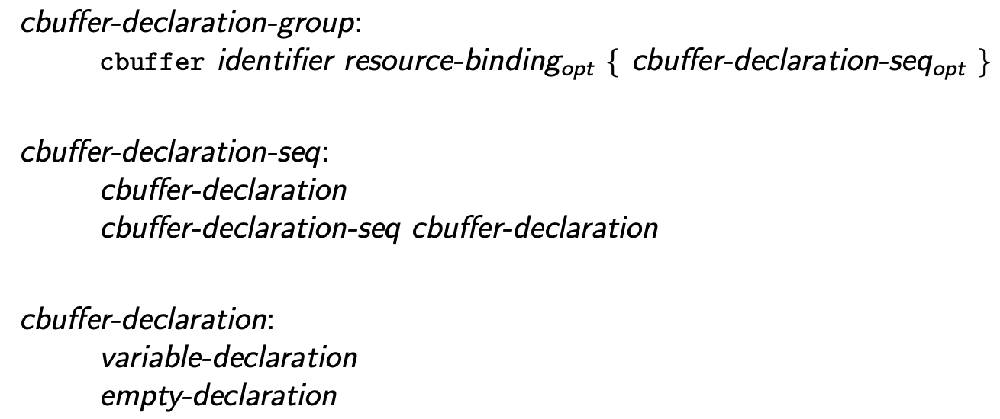

<!--  -->

# Refined `cbuffer` Contexts

## Instructions

* Proposal: [0037](0037-cbuffer-contexts.md)
* Author(s): [Chris Bieneman](https://github.com/llvm-beanz), [Helena Kotas](https://github.com/hekota)
* Sponsor: TBD
* Status: **Under Consideration**
* Planned Version: 202x
* Issues: [DXC #4514](https://github.com/microsoft/DirectXShaderCompiler/issues/4514)

## Introduction

This proposal aligns `cbuffer` declarations more closely with syntactic and
semantic behaviors that are common in C and C++ to align more closely with user
expectation and reduce the need for special case handling in the compiler.

## Motivation

The HLSL `cbuffer` declaration is a source of irregularity within the language
semantics, and the interaction between `cbuffer` declarations and their
contained declarations can be different and surprising.

In DXC, declarations inside a `cbuffer` are always hoisted out to translation
unit scope, which effectively ignores the namespace nesting, however the
declaration context hierarchy within a `cbuffer` is preserved except again in
the case of a nested `cbuffer` which pops back out to translation unit scope.

This behavior in DXC is clearly a bug, and FXC behaves more reasonably. As an
example given the following cbuffer declarations:

```hlsl
namespace ns {
  cbuffer CB {
    float a;

    namespace ns2 {
      cbuffer CB2 {
        float b;
      } // cbuffer CB2
    } // namespace ns2
  } // cbuffer CB
} // namespace ns
```
[FXC @ ShaderPlayground](https://shader-playground.timjones.io/22396dd8aec3318b3e9a598c612f156e)
[DXC @ Compiler Explorer](https://godbolt.org/z/WYK7jvvfP)

In DXC, `a` and `b` are referenced directly with no namespace qualifications,
while in FXC they are `ns::a` and `ns::ns2::b` respectively (unless the
namespace contains other variable declarations, which is clearly a bug:
https://godbolt.org/z/Ph57WYexr).

In FXC, `cbuffer` declarations behave more like a source range declaration that
groups global declarations into a single constant buffer rather than a semantic
declaration grouping. As such, one could replace the `cbuffer` syntax in FXC
with a preprocessor `pragma` with `push|pop` semantics that specified which
buffer and binding to group declarations into.

This design does not follow any pattern common in C or C++, and thus runs
counter to the [principle of least
astonishment](https://en.wikipedia.org/wiki/Principle_of_least_astonishment).

## Proposed solution

To simplify HLSL's language semantics and the compiler implementation a new
grammar formation is adopted for cbuffers:

```latex

\begin{grammar}
  \define{cbuffer-declaration-group}\br
  \terminal{cbuffer} identifier \opt{resource-binding} \terminal{\{}
  \opt{cbuffer-declaration-seq} \terminal {\}}\br

  \define{cbuffer-declaration-seq}\br
  cbuffer-declaration\br
  cbuffer-declaration-seq cbuffer-declaration\br

  \define{cbuffer-declaration}\br
  variable-declaration\br
  empty-declaration\br
\end{grammar}
```


This simplified grammar disallows members of `cbuffer` declarations that do not
have semantic meaning, and allows a simplification of `cbuffer` scoping rules.

A `cbuffer` may only be declared at translation unit or namespace scope. A
`cbuffer` may only contain non-static non-constexpr variable (or empty)
declarations. All declarations within a `cbuffer` declare names in the immediate
enclosing scope.

A `cbuffer` is a colection of constant values provided to a shader at runtime.
As such, it should only contain constant variable declarations backed by
read-only storage in device memory that persists across the life of the
dispatch.

Notably a `cbuffer` cannot contain function declarations, type declarations
(classes, enumerations, typedefs), namespace declarations, constexpr or static
variable declarations, `cbuffer` declarations, or any other declaration type not
explicitly listed as allowed.

<!--  -->
