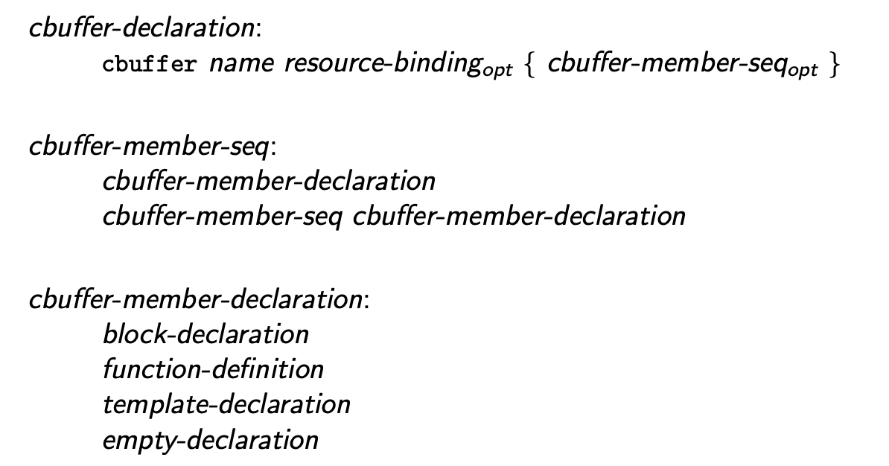

* Planned Version: 202x
* Issues: [DXC #4514](https://github.com/microsoft/DirectXShaderCompiler/issues/4514)

## Introduction

This proposal aligns `cbuffer` declarations more closely with syntactic and
semantic behaviors that are common in C and C++ to align more closely with user
expectation and reduce the need for special case handling in the compiler.

## Motivation

The HLSL `cbuffer` declaration is a source of irregularity within the language
semantics, and the interaction between `cbuffer` declarations and their
contained declarations can be different and surprising.

In DXC, declarations inside a `cbuffer` are always hoisted out to translation
unit scope, which effectively ignores the namespace nesting, however the
declaration context hierarchy within a `cbuffer` is preserved except again in
the case of a nested `cbuffer` which pops back out to translation unit scope.

This behavior in DXC is clearly a bug, and FXC behaves more reasonably. As an
example given the following cbuffer declarations:

```hlsl
namespace ns {
  cbuffer CB {
    float a;

    namespace ns2 {
      cbuffer CB2 {
        float b;
      } // cbuffer CB2
    } // namespace ns2
  } // cbuffer CB
} // namespace ns
```
[FXC @ ShaderPlayground](https://shader-playground.timjones.io/22396dd8aec3318b3e9a598c612f156e)
[DXC @ Compiler Explorer](https://godbolt.org/z/WYK7jvvfP)

In DXC, `a` and `b` are referenced directly with no namespace qualifications,
while in FXC they are `ns::a` and `ns::ns2::b` respectively (unless the
namespace contains other variable declarations, which is clearly a bug:
https://godbolt.org/z/Ph57WYexr).

In FXC, `cbuffer` declarations behave more like a source range declaration that
groups global declarations into a single constant buffer rather than a semantic
declaration grouping. As such, one could replace the `cbuffer` syntax in FXC
with a preprocessor `pragma` with `push|pop` semantics that specified which
buffer and binding to group declarations into.

This design does not follow any pattern common in C or C++, and thus runs
counter to the [principle of least
astonishment](https://en.wikipedia.org/wiki/Principle_of_least_astonishment).

## Proposed solution

To simplify HLSL's language semantics and the compiler implementation a new
grammar formation is adopted for cbuffers:

```latex
\begin{grammar}
  \define{cbuffer-declaration}\br
  \terminal{cbuffer} name \opt{resource-binding} \terminal{\{}
    \opt{cbuffer-member-seq} \terminal {\}}\br

  \define{cbuffer-member-seq}\br
  cbuffer-member-declaration\br
  cbuffer-member-seq cbuffer-member-declaration\br

  \define{cbuffer-member-declaration}\br
  block-declaration\br
  function-definition\br
  template-declaration\br
  empty-declaration
\end{grammar}
```


This simplified grammar restricts the declarations that are valid within a
cbuffer to declarations that are broadly valid inside block scopes as well as
function and template declarations. This allows a cbuffer to contain
declarations of classes and data types as well as functions and variables.

A `cbuffer` may only be declared at translation unit or namespace scope. A
`cbuffer` may not contain a namespace declaration and may only contain a subset
of valid global declarations.

## Detailed Design

> The following text will be included in the [Decl.cbuffer] section in the
> language specification.

A _cbuffer declaration_ is declared with the \texttt{cbuffer} keyword. The name
of the cbuffer declaration does not declare a name, and cannot be referenced
from within the translation unit, nor is it required to be unique. Each cbuffer
declaration refers to a unique constant buffer resource.

Declarations within a cbuffer declaration that declare names, declare their
names in the scope containing the cbuffer declaration. The cbuffer declaration
itself does not declare a declaration scope. A cbuffer declaration may not
contain a _namespace-declaration_ or _cbuffer-declaration_.

Variable declarations with program storage duration in the cbuffer declaration
are called _shader constants_. Shader constants are implicitly `const`
and cannot be modified in program code.

## Long-term Considerations

During our discussion in the language design meeting additional restrictions to
cbuffer declarations were considered. The general consensus was that additional
restrictions are desirable and will remove possible programmer errors, however
there were concerns about HLSL 202x changing too much at once.

In a future language version we may consider further restricting cbuffers to
allow only variable declarations of _program storage duration_.

In implementing cbuffer support in Clang we should consider implementing
a diagnostic for all variable declarations that are not of program storage
duration to identify potential programmer errors.
