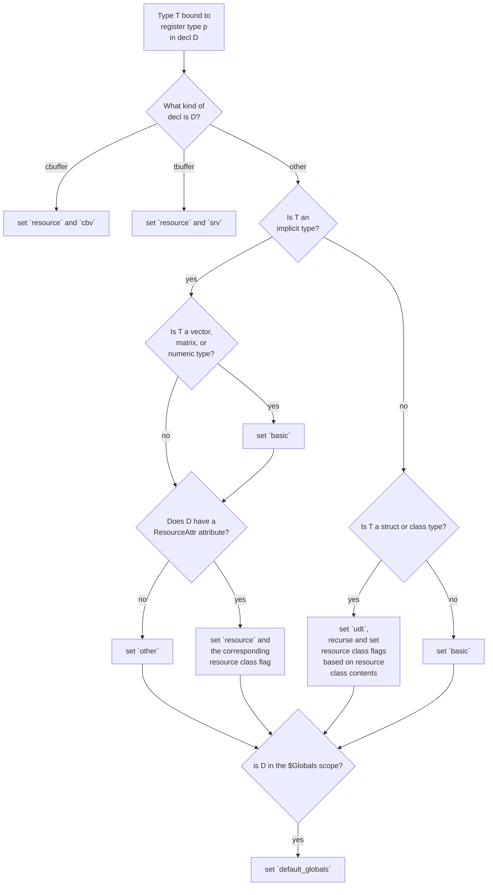

* Proposal: [0004](INF-0004-register-types-and-diagnostics.md)
* Author(s): [Joshua Batista](https://github.com/bob80905)
* Sponsor: TBD
* Status: **Under Consideration**
* Impacted Project(s): (LLVM)
* PRs: [#87578](https://github.com/llvm/llvm-project/pull/87578)
* Issues: [#57886](https://github.com/llvm/llvm-project/issues/57886)

## Introduction
Resources are often bound to registers of specific register types in HLSL.
For example:
```
RWBuffer<float> rwbuf: register(u0);
```
Here we have the resource type, `RWBuffer` with a resource element type of `float`
being declared as the variable `rwbuf`, and the variable is bound to a register. 
The register type is `u` and the register number is `0`.
There's a specific set of valid register types that can be used to bind a given 
resource in HLSL. When invalid register types are used to bind resources, helpful 
diagnostics need to be emitted so that the user knows why the resource type is 
invalid, or why the register type isn't correct. This spec defines the behavior
of the compiler for whenever an invalid register type is given, or for when a valid
register type is used to bind a resource type that for whatever reason is 
incompatible with that register type.

## Motivation

There are several cases in DXC in which diagnostics that are related to
invalid register types are out of date or invalid. For example, in the case of:

`float b : register(u4);`
an error will be emitted recommending the use of the 'b, c, or i' register
type. However the 'b' and 'i' register types are no longer in support. It
is worth noting that there is an overloading of the register(...) keyword
that applies to constant buffer variables using the 'c' register type, as
opposed to resources. 
Additionally, it is possible the user is unaware that this variable won't 
actually be used as a resource, but the compiler doesn't communicate that 
to the user. It would be great for any HLSL developer to immediately have
answers to the following questions:
For any valid resource type that needs to be bound, what are the set of
valid register types for that resource, and what are all the possible 
diagnostics that can be emitted if the resource is given a register 
type that isn't in the set of valid register types?
The design below aims to specify the answer to these questions.

## Proposed solution
Firstly, the most common case is when a resource type that is not a 
user-defined type is bound as a resource. Any resource will have an 
associated ResourceAttr attribute, from which we can determine the 
resource class The resource class data is sufficient to determine 
the expected register type, and any other register type will result 
in an error. The recommended register type will be suggested in the
diagnostic. The table below specifies what register type will be 
expected for any resource type that falls under the specified 
resource class. 

| Resource Class | Register Type | Diagnostic |
|-|-|-|
| Sampler | s | "%select{SRV|UAV|CBV|Sampler}2 type '%0' requires register type '%select{t|u|b|s}2', but register type '%1' was used." |
| SRV | t | "%select{SRV|UAV|CBV|Sampler}2 type '%0' requires register type '%select{t|u|b|s}2', but register type '%1' was used." |
| UAV | u | "%select{SRV|UAV|CBV|Sampler}2 type '%0' requires register type '%select{t|u|b|s}2', but register type '%1' was used." |
| CBuffer | b | "%select{SRV|UAV|CBV|Sampler}2 type '%0' requires register type '%select{t|u|b|s}2', but register type '%1' was used." |

If the given candidate resource is a user-defined type (UDT), then further
analysis is necessary. The first step is to gather all register declarations
that are being applied to this variable declaration, and collect the register types
that are being specified. The UDT must contain at least one valid resource
that can be bound to the provided register type(s). If not, an error must be
emitted stating that "No resource contained in struct '%0' can be bound
to register type '%1'". There are no issues if a UDT contains more resources
than there are register binding statements, the resources will be bound to
the next available space automatically, and so compilation can succeed.
Below are some examples of different UDT's and the diagnostics that
would be emitted when the resources contained within them are bound:

```
struct Eg1 {
  float f;
  Buffer<float> Buf;
  RWBuffer<float> RWBuf;
  };
Eg1 e1 : register(t0) : register(u0); 
// Valid: f is skipped, Buf is bound to t0, RWBuf is bound to u0

struct Eg2 {
  float f;
  Buffer<float> Buf;
  RWBuffer<float> RWBuf;
  RWBuffer<float> RWBuf2;
  };
Eg2 e2 : register(t0) : register(u0); 
// Valid: f is skipped, Buf is bound to t0, RWBuf is bound to u0. RWBuf2 gets automatically assigned to u1 even though there is no explicit binding for u1.

struct Eg3 {
  float f;
  Buffer<float> Buf;
  }; 
Eg3 e3 : register(t0) : register(u0);
// Valid: Buf gets bound to t0. Buf will also be bound to u0.

struct Eg4 {
  struct Bar {
    RWBuffer<int> a;
    };
    Bar b;
};
Eg4 e4 : register(t0) 
// Valid: Bar, the struct within Eg4, has a valid resource that can be bound to t0. 

struct Eg5 {
  SamplerState s[3];
};

Eg5 e5 : register(s5);
// Valid: the first sampler state object within Eg5's s is bound to slot 5

struct Eg6 {
  float f;
}; 
Eg6 e6 : register(t0) 
// DefaultError warning: "UDT resource 'Eg6' does not contain an applicable resource type for register type 't'"

struct Eg7 {
  struct Bar {
      float f;
    }
    Bar b;
};
Eg7 e7 : register(t0) 
// DefaultError warning: "UDT resource 'Eg7' does not contain an applicable resource type for register type 't'"

```

Finally, if the candidate type is not a valid resource type or not a UDT, the
final case will be entered. Types that are or contain a resource are known as
"intangible". In this case, we are dealing with types that cannot be intangible.
Types that can be immediately determined to not be intangible (that is, types that
cannot be a resource type or cannot contain a resource type) are types like booleans,
int, float, float4, etc. If the variable type is among any numerics or a type that
cannot be an intangible type, there is only one exception where the register keyword
can legally be applied to the variable. The only valid register type for such a 
numeric variable type is 'c'. The register keyword in this statement:
`float f : register(c0)`
isn't binding a resource, rather it is specifying a constant register binding offset
within the $Globals cbuffer, which is legacy behavior from DX9. All other register types
applied to such a type will emit an error diagnostic that "'%0' is an invalid resource
type for register type '%1'", except for 'b' or 'i'. If the register type is 'b' or 'i',
a warning will be emitted instead, that will be treated as an error by default.
Below are some examples:

| Code | Diagnostic |
|-|-|
| `float f : register(t0)` | "error: 'float' is an invalid resource type for register type 't'" |
| `float f : register(c0)` | Valid, no errors
| `float f : register(b0)` | "warning: deprecated legacy bool constant register binding 'b' used. 'b' is only used for constant buffer resource binding. Disable with --Wno-disallow-legacy-binding-rules" |
| `float f : register(i0)` | "warning: deprecated legacy int constant register binding 'i' used. Disable with --Wno-disallow-legacy-binding-rules" |
| `float f : register(x0)` | "error: register binding type 'x' not supported for variable of type 'float'" |


## Detailed design

All the compiler has to work with is a Decl object and the context the decl appears in.
From this information, the first goal is to set a specific set of flags that can fully inform
the right diagnostic to emit. The first group of flags are the decl type flags, which
are either `basic`, `resource`, `udt`, or `other`. `basic` refers to a numeric variable
type. `other` refers to a type that cannot possibly be resource, because it lacks the 
resource attribute.<br>
The next group of flags are the resource class flags,
which are `srv`, `uav`, `cbv`, or `sampler`.<br>
The final flag is `default_globals`, which indicates whether or not the decl appears
inside the $Globals scope.<br><br>

From the Decl object, first determine if the decl is a cbuffer or tbuffer decl. If so,
we know the decl is a `resource` and can infer the resource class (`cbv` or `srv`
respectively). Otherwise, the decl is classified according to the underlying canonical 
type.<br>
If the decl is implicit, then check if the decl is a vector, matrix, or otherwise numeric type,
and if so, we know that the decl is a `basic` type. If the decl has a resource attribute, 
we can set the `resource` flag, and can also obtain the resource class and set the resource 
class flag accordingly. Otherwise, we know the decl is not a resource and not basic, and so
the `other` flag is set.<br>
If the decl is not implicit, then we check if it is a struct or class type, and if so, the
decl is a UDT, so the `udt` flag is set. We then recurse through the members of the UDT and
collect information on what types of resources are contained by the UDT (uav, cbv, srv, or
sampler). The corresponding resouce class flags are set. If the decl is not a struct or class
type, then it is a basic type, and so the `basic` flag is set.<br>
The last step is to simply check if the decl is in the `$Globals` scope. If so, then the
`default_globals` flag will be set.<br><br>

Now enough information has been gathered to determine the right diagnostics to emit, if any.
Firstly, if `other` is set, then the variable type is not valid for the given register type.
So, we can emit this diagnostic: `error: '%0' is an invalid resource type for register type '%1'`
If the `resource` flag is set and the `udt` flag is not set, then we have to check the 
register statement, and the resource class flag, and verify that the register type matches the 
resource class flag. If not, we emit this diagnostic: 
`error; %select{SRV|UAV|CBV|Sampler}2 type '%0' requires register type '%select{t|u|b|s}2', but register type '%1' was used.`
If the `basic` flag is set, then we first check if `default_globals` is set. If so, then 
we check the register type. If the register type is 'i' or 'b', the deprecated warning
that is treated as an error as shown in the examples above will be emitted. If 'c' is given,
no errors will be emitted. After this point, `default_globals` doesn't need to be set.
If 't', 'u', or 's' are given, then this diagnostic will be emitted:
`error: '%0' is an invalid resource type for register type '%1'`. If any other register type
is seen, this error will be emitted:
`error: register binding type '%1' not supported for variable of type '%0'`<br><br>

Finally, in the case that `udt` is set, we first check `default_globals`. If it is set,
then we can permit the 'c' register type. After this point, `default_globals` doesn't
need to be set. For every register type that is used to bind the resources contained in
the given UDT, we verify that the corresponding resource class flag has been set. If the
corresponding resource class flag is not set, this error will be emitted:
`error: variable of type '%0' bound to register type '%1' does not contain a matching '%select{SRV|UAV|CBV|Sampler}2' resource`
Otherwise, if any other register type is given, then we emit this error:
`error: register binding type '%0' not supported for variable of type '%1'`<br><br>

Legacy behavior can be allowed with the --Wno-disallow-legacy-binding-rules
flag. When this flag is active, and legacy behavior is present, a warning will 
be emitted instead of an error.<br><br>

Below are two flowcharts that describe the process that is used to determine
what kind of diagnostic to emit in each case. First the analysis step, then
second the diagnostic emission step.



```mermaid
flowchart TD
A[Is `other` set?] -- yes --> B[error: register
binding not 
allowed on 
variable of 
type '%0']
A -- no --> C{Is `resource` set?}
C -- yes --> D{Is the given
register type
correct for the
given resource type?}
D -- yes -->E{is `basic` set?}
D -- no --> F{error: %select{SRV|UAV|CBV|Sampler}2
type '%0' requires 
register type 
'%select{t|u|b|s}2', 
but register type 
'%1' was used.}
E -- yes --> G{is `default_globals` set?}
G -- yes --> H{What is the given register type?}
H -- 'i' --> I[warning: deprecated legacy int constant register binding 'i' used]
H -- 'b' --> J[warning: deprecated legacy bool constant register binding 'b' used. 'b' is used for constant buffer resource binding.]
H -- 'c' --> K[no error]
H -- else --> L[error: register binding type '%1' not supported for variable of type '%0']
E -- no --> M{is `udt` set?}
C -- yes --> M
C -- no --> N[assert: other would 
be set if resource
isn't set.]
M -- yes --> O{Is `default_globals` set?}
O -- yes --> P{What register type was given?}
P -- 'c' --> Q[no error]
P -- 't|u|b|s' --> R[error: variable of 
type '%0' bound to
register type '%1' 
does not contain a
matching 
'%select{SRV|UAV|CBV|Sampler}2'
resource]
P -- else --> S[error: register binding type
'%1' not supported 
for variable 
of type '%0']

```


## Alternatives considered (Optional)

## Acknowledgments (Optional)
* Tex Riddell
* Chris Bieneman
* Justin Bogner
* Damyan Pepper
<!--  -->