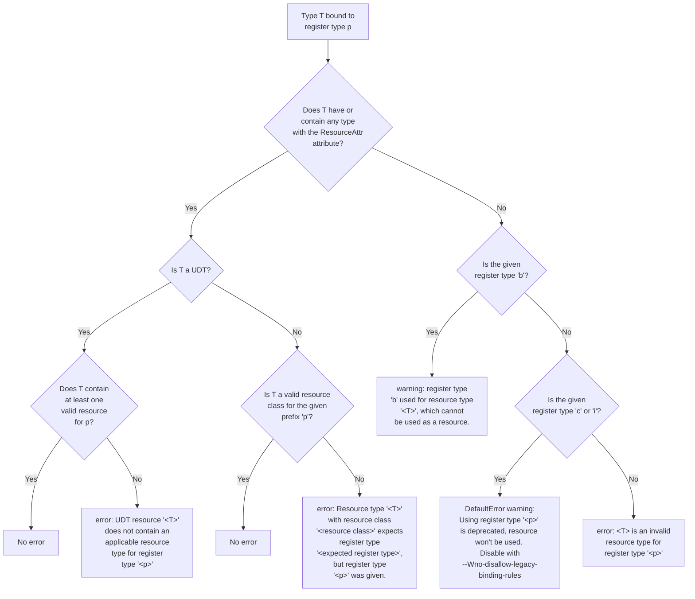

* Proposal: [0004](INF-0004-register-types-and-diagnostics.md)
* Author(s): [Joshua Batista](https://github.com/bob80905)
* Sponsor: TBD
* Status: **Under Consideration**
* Impacted Project(s): (LLVM)
* PRs: [#87578](https://github.com/llvm/llvm-project/pull/87578)
* Issues: [#57886](https://github.com/llvm/llvm-project/issues/57886)

## Introduction
Resources are often bound to registers of specific register types in HLSL.
For example:
```
RWBuffer<float> rwbuf: register(u0);
```
Here we have the resource type, `RWBuffer` with a resource element type of `float`
being declared as the variable `rwbuf`, and the variable is bound to a register. 
The register type is `u` and the register number is `0`.
There's a specific set of valid register types that can be used to bind a given 
resource in HLSL. When invalid register types are used to bind resources, helpful 
diagnostics need to be emitted so that the user knows why the resource type is 
invalid, or why the register type isn't correct. This spec defines the behavior
of the compiler for whenever an invalid register type is given, or for when a valid
register type is used to bind a resource type that for whatever reason is 
incompatible with that register type.

## Motivation

There are several cases in DXC in which diagnostics that are related to
invalid register types are out of date or invalid. For example, in the case of:

`float b : register(u4);`
an error will be emitted recommending the use of the 'b, c, or i' register
type, however these register types are no longer in support. Additionally,
it is possible the user is unaware that this resource won't actually be
used, but the compiler doesn't communicate that to the user.
It would be great for any HLSL developer to immediately have answers to 
the following questions:
For any valid resource type that needs to be bound, what are the set of
valid register types for that resource, and what are all the possible 
diagnostics that can be emitted if the resource is given a register 
type that isn't in the set of valid register types?
The design below aims to specify the answer to these questions.

## Proposed solution
Firstly, the most common case is when a resource type that is not a 
user-defined type is bound as a resource. Any resource will have an 
associated ResourceAttr attribute, from which we can determine the 
resource class and resource kind. These two inputs are sufficient to
determine the expected register type, and any other register type
will result in an error. The recommended register type will be
suggested in the diagnostic. The table below specifies what register 
type will be expected for any resource type that falls under the
specified resource class. 

| Resource Class | Register Type | Diagnostic |
|-|-|-|
| Sampler | s | "Object type '%0' with resource class "Sampler" expects register type 's', but register type '%1' was given." |
| SRV | t | "Object type '%0' with resource class "SRV" expects register type 't', but register type '%1' was given." |
| UAV | u | "Object type '%0' with resource class "UAV" expects register type 'u', but register type '%1' was given." |
| CBuffer | b |  "Object type '%0' with resource class "CBuffer" expects register type 'b', but register type '%1' was given." |

If the given candidate resource is a user-defined type (UDT), then further
analysis is necessary. The first step is to gather all registers that
are being bound to this declaration, and collect the register types
that are being specified. The UDT must have at least one valid resource
that can be bound to the provided register type(s). If not, an error must be
emitted stating that "No resource contained in struct '%0' can be bound
to register type '%1'". There are no issues if a UDT has more resources
than there are register binding statements, the resources will be bound to
the next available space automatically, and so compilation can succeed.
Additionally, a singular resource can be bound multiple times to different
spaces, so multiple register types are allowed for a single resource.
Below are some examples of different UDT's and the diagnostics that
would be emitted when they are bound:

```
struct Eg1 {
  float f;
  Buffer<float> Buf;
  RWBuffer<float> RWBuf;
  };
Eg1 e1 : register(t0) : register(s0); 
// Valid: f is skipped, Buf is bound to t0, RWBuf is bound to s0

struct Eg2 {
  float f;
  Buffer<float> Buf;
  RWBuffer<float> RWBuf;
  RWBuffer<float> RWBuf2;
  };
Eg2 e2 : register(t0) : register(s0); 
// Valid: f is skipped, Buf is bound to t0, RWBuf is bound to s0. RWBuf2 gets assigned to s1 even though there is no explicit binding for s1.

struct Eg3 {
  float f;
  Buffer<float> Buf;
  }; 
Eg3 e3 : register(t0) : register(s0);
// Valid: Buf gets bound to t0. Buf will also be bound to s0.

struct Eg4 {
  struct Bar {
    RWBuffer<int> a;
    };
    Bar b;
};
Eg4 e4 : register(t0) 
// Valid: Bar, the struct within Eg4, has a valid resource that can be bound to t0. 

struct Eg5 {
  float f;
}; 
Eg5 e5 : register(t0) 
// DefaultError warning: "UDT resource 'Eg5' does not contain an applicable resource type for register type 't'"

struct Eg6 {
  struct Bar {
      float f;
    }
    Bar b;
};
Eg6 e6 : register(t0) 
// DefaultError warning: "UDT resource 'Eg6' does not contain an applicable resource type for register type 't'"|

```

Finally, if the candidate type is not a valid resource type or not a UDT, the
final case will be entered. Types that are or contain a resource are known as
"intangible". In this case, we are dealing with types that cannot be intangible.
Types that can be immediately determined to not be intangible (that is, types that
cannot be a resource type or cannot contain a resource type) are types like booleans,
int, float, float4, etc. If the resource type is among any numerics or a type that
cannot be an intangible type, there is only one exception where it can be treated
as a resource. The only valid register type for such resource types is 'b', which
adheres to legacy behavior. All other register types applied to such a type will 
emit an error diagnostic that "the given type '%0' cannot be bound as a resource".
If the register type is 'b', a warning will be emitted instead, that will be
treated as an error by default: "register type 'b' used for resource type '%0', 
which cannot be used as a resource". Below are some examples:

| Code | Diagnostic |
|-|-|
| `float f : register(t0)` | "error: 'float' is an invalid resource type for register type 't'" |
| `float f : register(b0)` | DefaultError "warning: register type 'b' used for resource type 'float', which cannot be used as a resource. Disable with --Wno-disallow-legacy-binding-rules" |


## Detailed design

All the compiler has to work with is a Decl object. From the Decl object, 
the ResourceAttr attribute can be fetched, with which the resource 
class can be determined. Once this is known, we then check if the resource
type is a user-defined type or if it is a standard resource type. If the 
resource type is among the standard resource types (e.g., cbuffer, tbuffer,
RWBuffer, etc.), then the register type is checked for validity. If there is
an incompatibility between resource class and register type, a diagnostic will
be emitted. Otherwise, the resource is a user-defined type, and so the type needs
to be validated to see whether it can properly be assigned to the given register 
type. If the UDT does not have at least one resource that matches the given register 
types, then an error will be emitted. The only remaining case is when there
is no resource attribute, which implies the type cannot be intangible. In this case,
if the type is strictly numeric, the only acceptable register type is 'b', which 
is legacy behavior. In this case, a warning will be emitted that will be treated as 
an error by default, which states that a numeric type is not usable as a resource. 
If 'c' or 'i' are given as register types, a warning will be emitted stating that
such register types are legacy behavior, and the resource won't be used. Any other 
register type will cause an error to be emitted, stating that the given resource
type cannot be bound as a resource.
Legacy behavior can be allowed with the --Wno-disallow-legacy-binding-rules
flag. When this flag is active, and legacy behavior is present, a warning will 
be emitted instead of an error.

Below is a flowchart that describes the process that is used to determine
what kind of diagnostic to emit in each case:




## Alternatives considered (Optional)

## Acknowledgments (Optional)
* Tex Riddell
* Chris Bieneman
* Justin Bogner
* Damyan Pepper
<!--  -->