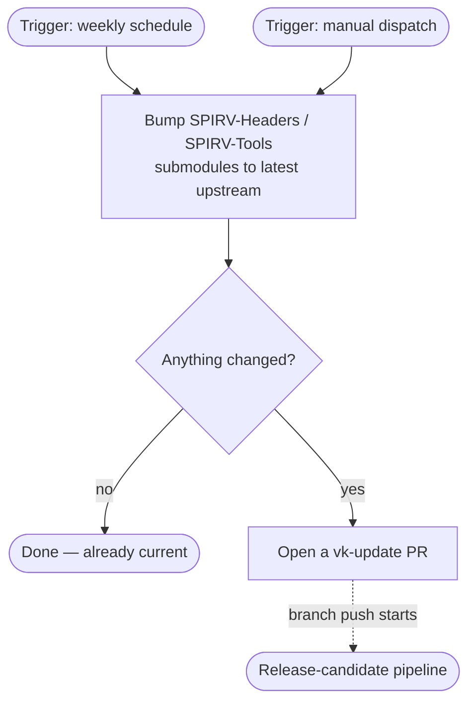
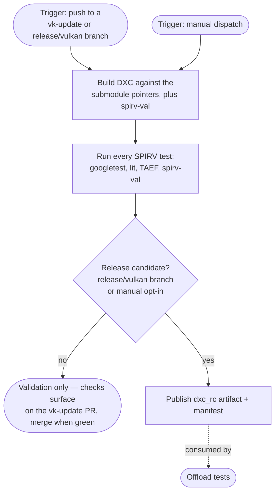
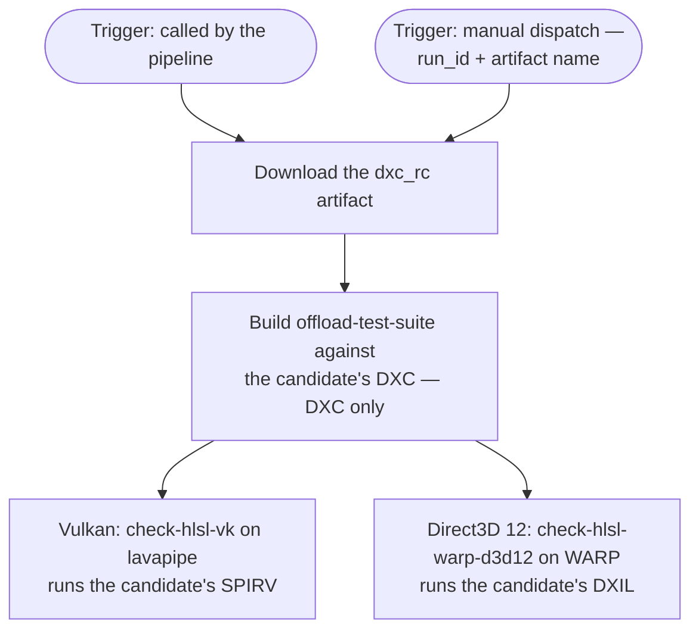

* Impacted Projects: DXC

## Introduction

DXC is included in the Vulkan SDK. Before each SDK release, the DXC submodule
references (SPIRV-Headers, SPIRV-Tools) need to be updated and the product needs
to be tested. This process has previously been mostly performed manually. This
document details the requirements for ensuring DXC is ready for inclusion in the
Vulkan SDK and proposes the changes required in order to satisfy them.

## Motivation

SPIRV-Headers and SPIRV-Tools need to be kept up to date so that the most recent
SPIRV features are available in DXC. We need to verify that DXC is generating
valid SPIRV code and that there are no regressions. The process needs to be
documented and automated enough so that it does not rely on individuals with
special knowledge. Additionally, we want to align the version included in the
Vulkan SDK with a formal DXC release so that it matches up with GitHub and NuGet
releases and can be ingested into Godbolt.

## Proposed solution

The SPIRV-Headers and SPIRV-Tools submodules are the single source of truth for the
SPIRV revisions a candidate is built against. Once a week a workflow bumps them to the
latest upstream commit and opens a pull request to merge that bump into `main`. The
pull request runs the release-candidate pipeline, building DXC against
the bumped submodules and running the SPIRV tests.

For an SDK release, the pipeline also publishes the candidate as an artifact and runs
the LLVM [offload-test-suite](https://github.com/llvm/offload-test-suite) against it,
using lavapipe as the SPIRV driver and WARP as the DXIL driver. DXC from the Vulkan SDK
is also used for DirectX, so its DXIL output is worth testing too. The SDK builders are
handed the validated DXC commit, recorded in the manifest, not the artifact.

The automation is split into three workflows, each shown below starting from its triggers:

**1. Weekly submodule update** — keeps the SPIRV dependencies updated.



**2. Release-candidate pipeline** — builds and tests DXC; for a release candidate it
also publishes the artifact and runs the offload tests.



**3. Offload tests** — runs the offload-test-suite against the published candidate on
software renderers, split by API.



### Dependency update

A scheduled job runs once a week (and can be triggered on demand). Such advances the
SPIRV-Headers and SPIRV-Tools submodules to their latest upstream commit and, if
anything changed, commits the new pointers onto a fresh `vk-update/<date>` branch and
opens a pull request against the default branch. Pushing that branch starts the
release-candidate pipeline, whose checks attach to the commit and show on the pull
request, so the bump is reviewed and merged only once the candidate is green. 

### Release Pipeline

The release pipeline runs on every push to a `vk-update/<date>` branch (the weekly job
creates these) or a `release/vulkan/<version>` branch (cut by hand for a release;
see [Release Steps](#Release Steps)), and can be started manually from the GitHub UI. 
The build and test stages run on every push; the publish and offload stages run only 
for a release candidate — a `release/vulkan/<version>` branch, or a manual run that 
opts in.

1. **Build.** DXC is checked out with its submodules, so it builds against exactly
   the SPIRV the pointers name, configured with SPIRV code generation and the SPIRV
   tests enabled. The build also produces the tools the tests need, including
   `spirv-val`.

2. **Test.** Every SPIRV test in the DXC repo runs here, across all of its harnesses:
   the googletest unit tests, the lit CodeGenSPIRV tests, and the TAEF tests; the
   binary's output is then checked with `spirv-val`. Each result is recorded
   in the manifest, including failed tests. The logs also contain further information
   where each file is located and what was exected. This stage is non-blocking —
   a release candidate is published even if some tests fail.

4. **Publish.** The DXC binaries (`dxc`, `dxv`, and `dxcompiler.dll`), the manifest,
   and the test reports are uploaded as a single artifact named `dxc_rc_<version>`.

5. **Offload tests.** A separate job runs the LLVM offload-test-suite against the
   published artifact, with DXC as the only compiler (the in-tree clang compiler is
   disabled). The Vulkan tests (`check-hlsl-vk`) on lavapipe and the Direct3D 12
   tests (`check-hlsl-warp-d3d12`) on WARP. Because it consumes the published artifact
   rather than the build tree, this job can also be run on its own against any earlier candidate.

### Release manifest

The manifest records the DXC commit, the SPIRV-Headers and SPIRV-Tools commits the
candidate was built against, the tests results, and a single `validated` flag
that is true only when every test passed:

```json
{
  "dxc_commit": "<sha>",
  "spirv_dependencies": {
    "SPIRV-Headers": "<sha>",
    "SPIRV-Tools": "<sha>"
  },
  "test_suites": [
    { "name": "spirv-unit", "passed": 105, "failed": 0 },
    { "name": "spirv-codegen", "passed": 1564, "failed": 0 },
    { "name": "spirv-taef", "passed": 1, "failed": 0 },
    { "name": "spirv-val", "passed": 6, "failed": 0 }
  ],
  "validated": true
}
```

### Release Steps

These steps are performed by whoever is currently responsible for monitoring the
llvm-build, and may be repeated as needed:

1. Update the SPIRV-Headers and SPIRV-Tools submodules to the commits specified by
   LunarG.
2. Create the `release/vulkan/<version>` branch, which triggers the pipeline.
3. Check whether the resulting candidate is validated (see
   [Release Candidate readiness](#release-candidate-readiness)).
4. Report the validated DXC commit to LunarG.

### Release Candidate readiness

The following must be true and validated for a release candidate to be considered
ready for the Vulkan SDK.

* It builds against the SPIRV-Headers and SPIRV-Tools commits the submodules are
  pinned to.
* Every SPIRV test harness passes — the googletest, lit, and TAEF tests — and the
  SPIRV the binary emits validates under `spirv-val`.
* The shaders the candidate compiles execute on the offload-test-suite under both
  software renderers: the SPIRV on lavapipe (Vulkan) and the DXIL on WARP (Direct3D 12).
* The manifest records the result, with `validated` set to `true`.
